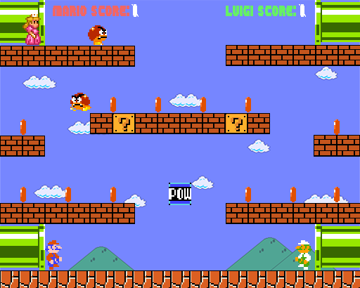

# Mario Game

Super Mario game created in semester 2 as part of Games Engine Creation module.

*A list of features that I was able to implement into the game.*
|  Main Features        | Additional Features   | Complex Features      |
| :-------------------: | :-------------------: | :-------------------: |
| Sprite Rendering      | Coin Collectibles     | More Sound Effects    |
| POW Block             | Scoring System        | User Interface        |
| Enemy Characters      | More Enemies          | Start Menu            |
| Basic Audio           | Peach (Win Condition) | Level 2               |
|                       | Lose Condition        | Score Menu            |
|                       | Pause Menu            |                       |
|                       | Fonts Rendering       |                       |

