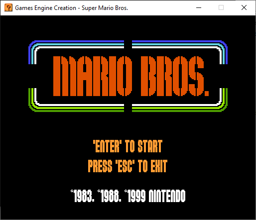
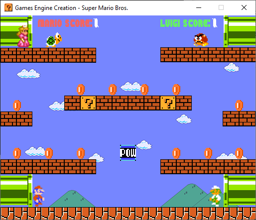

# Mario Game

Super Mario game created in semester 2 as part of Games Engine Creation module.

*Click any image to view on YouTube*

## List of Features

- [x] Sprite Rendering
- [x] Enemy Characters
- [x] Collectibles
- [x] Score System
- [x] Win/Lose Conditions
- [x] Font Rendering
- [x] User Interface
- [x] Level System
- [x] POW Block
- [x] Sound Effects

---

### Credits

        Audio:
                    https://themushroomkingdom.net/media/smb/wav
                    https://www.mariomayhem.com/downloads/sounds/
                    
        Sprites:
                    https://www.spriters-resource.com/nes/supermariobros/
                    https://www.spriters-resource.com/snes/smarioworld/
